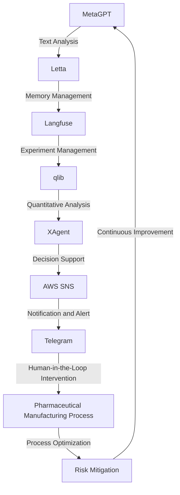

# Pharmaceutical Manufacturing Risk Mitigation Engine
> Orchestrating MetaGPT, Letta, Langfuse, qlib, XAgent, AWS SNS, and Telegram to Mitigate High-Stakes Manufacturing Risks in Chemical and Pharmaceutical Industries

## 🏗️ Technical Architecture & Multi-Agent Flow

This complex technical architecture enables the seamless integration of multiple agents, each with its unique capabilities, to mitigate risks in pharmaceutical manufacturing. The flow begins with MetaGPT, which performs text analysis on manufacturing data, and then passes the output to Letta for memory management. Langfuse takes over for experiment management, followed by qlib for quantitative analysis, and XAgent for decision support. The output is then sent to AWS SNS for notification and alert, which triggers human-in-the-loop intervention via Telegram. The ultimate goal is to optimize the pharmaceutical manufacturing process and achieve continuous improvement through risk mitigation.

## 🔍 The Vertical Bottleneck: Pharmacokinetic and Pharmacodynamic Modeling
The pharmaceutical manufacturing industry faces significant challenges in modeling complex pharmacokinetic and pharmacodynamic relationships. These models are crucial for predicting drug efficacy, toxicity, and optimal dosing regimens. However, the high dimensionality of the data, non-linear relationships, and uncertainty in model parameters make it difficult to develop accurate models. The lack of effective modeling tools and techniques can lead to suboptimal drug development, increased costs, and reduced patient outcomes. Furthermore, the complexity of these models requires significant computational resources, expertise in machine learning and statistics, and large amounts of high-quality data.

The technical friction in pharmacokinetic and pharmacodynamic modeling arises from the need to integrate multiple data sources, including in vitro and in vivo experiments, clinical trials, and real-world evidence. The data must be processed, transformed, and analyzed using various techniques, such as machine learning, statistical modeling, and simulation. The results must then be interpreted and translated into actionable insights for drug development, regulatory approval, and clinical practice. The high-stakes nature of these decisions demands accurate, reliable, and efficient modeling tools and techniques.

The mathematical and operational failures in pharmacokinetic and pharmacodynamic modeling can have significant consequences, including delayed or failed drug development, increased costs, and reduced patient outcomes. The lack of effective modeling tools and techniques can lead to suboptimal drug development, increased costs, and reduced patient outcomes. Therefore, it is essential to develop and apply advanced modeling techniques, such as machine learning and artificial intelligence, to improve the accuracy, efficiency, and reliability of pharmacokinetic and pharmacodynamic modeling.

## 💡 The Solution: Pharmaceutical Manufacturing Risk Mitigation Engine
The Pharmaceutical Manufacturing Risk Mitigation Engine is a cutting-edge platform that orchestrates MetaGPT, Letta, Langfuse, qlib, XAgent, AWS SNS, and Telegram to mitigate risks in pharmaceutical manufacturing. The platform leverages the strengths of each agent to develop a comprehensive risk mitigation strategy. MetaGPT performs text analysis on manufacturing data to identify potential risks and opportunities. Letta manages memory and context to ensure that the platform can learn from experience and adapt to changing conditions. Langfuse manages experiments and simulations to develop and validate pharmacokinetic and pharmacodynamic models. qlib performs quantitative analysis to identify optimal dosing regimens and predict drug efficacy and toxicity. XAgent provides decision support to identify the most effective risk mitigation strategies. AWS SNS and Telegram enable human-in-the-loop intervention and notification to ensure that the platform is aligned with business objectives and regulatory requirements.

The platform's agentic reasoning is based on a hybrid approach that combines machine learning, statistical modeling, and simulation. The memory usage is optimized through Letta's memory management capabilities, which enable the platform to learn from experience and adapt to changing conditions. The vision and robotics integration is enabled through the use of machine learning and computer vision techniques, which enable the platform to analyze and interpret complex data from various sources.

## 🧩 Agentic Stack Deep-Dive
The agentic stack is composed of multiple agents, each with its unique capabilities and strengths. MetaGPT is a state-of-the-art language model that performs text analysis and generates human-like text. Letta is a memory management agent that enables the platform to learn from experience and adapt to changing conditions. Langfuse is an experiment management agent that develops and validates pharmacokinetic and pharmacodynamic models. qlib is a quantitative analysis agent that identifies optimal dosing regimens and predicts drug efficacy and toxicity. XAgent is a decision support agent that identifies the most effective risk mitigation strategies. AWS SNS and Telegram enable human-in-the-loop intervention and notification to ensure that the platform is aligned with business objectives and regulatory requirements.

The integration of these agents is enabled through a combination of APIs, data pipelines, and messaging protocols. The platform uses a microservices architecture to enable scalability, flexibility, and maintainability. Each agent is designed to be modular and independent, with well-defined interfaces and APIs. The platform uses a combination of synchronous and asynchronous communication protocols to enable real-time data exchange and processing.

## ✨ Capabilities & Features
* **Text Analysis**: MetaGPT performs text analysis on manufacturing data to identify potential risks and opportunities.
* **Memory Management**: Letta manages memory and context to ensure that the platform can learn from experience and adapt to changing conditions.
* **Experiment Management**: Langfuse manages experiments and simulations to develop and validate pharmacokinetic and pharmacodynamic models.
* **Quantitative Analysis**: qlib performs quantitative analysis to identify optimal dosing regimens and predict drug efficacy and toxicity.
* **Decision Support**: XAgent provides decision support to identify the most effective risk mitigation strategies.
* **Human-in-the-Loop Intervention**: AWS SNS and Telegram enable human-in-the-loop intervention and notification to ensure that the platform is aligned with business objectives and regulatory requirements.
* **Real-Time Data Processing**: The platform uses real-time data processing to enable timely and effective risk mitigation.
* **Scalability and Flexibility**: The platform uses a microservices architecture to enable scalability, flexibility, and maintainability.
* **Security and Compliance**: The platform ensures security and compliance with regulatory requirements and industry standards.
* **Continuous Improvement**: The platform enables continuous improvement through machine learning, statistical modeling, and simulation.

## 🛠️ Technical Implementation
The technical implementation of the platform involves a combination of machine learning, statistical modeling, and simulation. The platform uses a microservices architecture to enable scalability, flexibility, and maintainability. Each agent is designed to be modular and independent, with well-defined interfaces and APIs. The platform uses a combination of synchronous and asynchronous communication protocols to enable real-time data exchange and processing.

The code organization and method calls are designed to be modular and flexible, with a focus on reusability and maintainability. The platform uses a combination of Python, R, and Julia programming languages to enable flexibility and scalability. The data storage and management are enabled through a combination of relational and NoSQL databases, with a focus on data integrity, security, and compliance.

## 📊 Business Impact & ROI
The Pharmaceutical Manufacturing Risk Mitigation Engine has the potential to significantly impact the pharmaceutical manufacturing industry by reducing risks, improving efficiency, and increasing productivity. The platform can help pharmaceutical manufacturers to identify and mitigate potential risks, optimize dosing regimens, and predict drug efficacy and toxicity. The platform can also enable real-time data processing, human-in-the-loop intervention, and continuous improvement through machine learning, statistical modeling, and simulation.

The return on investment (ROI) for the platform can be significant, with potential benefits including reduced costs, improved efficiency, and increased productivity. The platform can also enable pharmaceutical manufacturers to comply with regulatory requirements and industry standards, reducing the risk of non-compliance and associated costs.

## 🚀 Getting Started
```bash
git clone https://github.com/arvind-sundararajan/pharma-manufacturing-risk-mitigation.git
cd pharma-manufacturing-risk-mitigation
pip install -r requirements.txt
python src/main.py
```
This will clone the repository, install the required dependencies, and run the platform.

## 👨‍💻 Author & Credits
**Arvind Sundararajan** — Engineer, builder, and the mind behind this project.
🌐 [LinkedIn](https://www.linkedin.com/in/arvind-sundara-rajan/) | Chennai, India

---
### 🙏 Acknowledgements
- The open-source community
- The Chemical & Pharma Manufacturing practitioners who inspired this design